# Project O — High Level Design Document

> Real-time 1v1 video networking and mentorship platform for college students.

---

## 1. System Overview

Project O is a full-stack web application that enables college students to connect via live video calls in two modes: **spontaneous random matching** (Fun 1v1) and **structured mentorship booking** (Guided 1v1). The system is built on a decoupled frontend-backend architecture with real-time WebSocket communication for matchmaking and WebRTC signaling.

### Key System Properties
- **Authentication**: Passwordless OTP via college email (domain-whitelisted)
- **Real-Time**: Socket.IO for matchmaking state and WebRTC signaling
- **Video**: Peer-to-peer via browser WebRTC (no media server)
- **Persistence**: PostgreSQL for durable data, Redis for ephemeral state
- **Security**: Multi-layer (JWT, rate limiting, Helmet CSP, auto-moderation)

---

## 2. Architecture Diagram

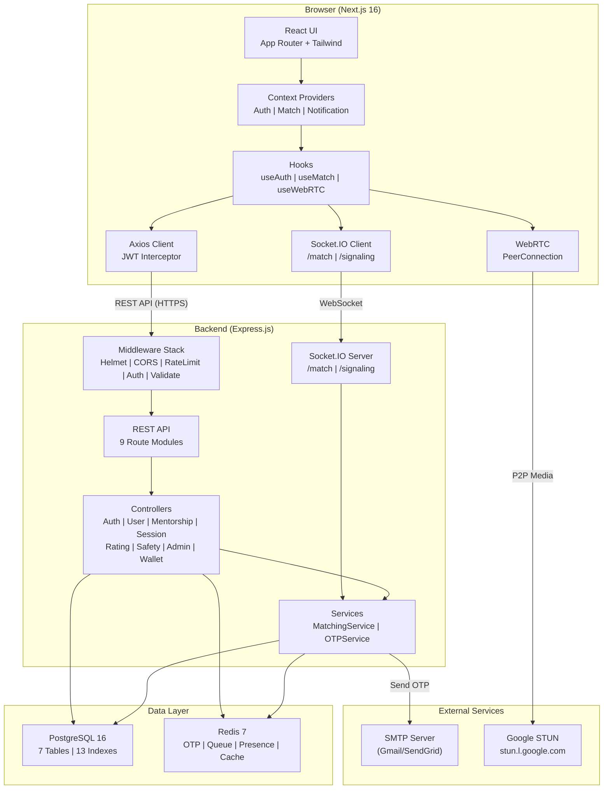

---

## 3. Component Breakdown

### Frontend Components

| Component | Responsibility |
|-----------|---------------|
| **App Router** | File-based routing, layouts, metadata, Suspense loading states |
| **AuthProvider** | JWT lifecycle, localStorage hydration, login/logout/updateUser |
| **MatchProvider** | Socket.IO match queue FSM (idle → queued → matched → in-call) |
| **NotificationProvider** | Toast notifications with auto-dismiss and progress animation |
| **useWebRTC** | Full WebRTC lifecycle: getUserMedia → PeerConnection → signaling → cleanup |
| **AuthGuard** | Route protection, onboarding redirect, loading spinner |
| **AppLayout** | Authenticated shell with sidebar navigation (desktop) + hamburger (mobile) |
| **API Client** | 9 typed modules, JWT interceptor, global 401 handler |
| **Socket Manager** | Singleton Socket.IO clients per namespace, JWT auth handshake |

### Backend Components

| Component | Responsibility |
|-----------|---------------|
| **server.js** | Express app, HTTP server, Socket.IO attachment, boot sequence |
| **Middleware Stack** | Security headers, CORS, rate limiting, JWT auth, input validation |
| **Controllers (8)** | Request handling, business logic, response formatting |
| **MatchingService** | Redis FIFO queue, block-list filtering, session creation, presence |
| **OTPService** | Secure OTP generation, Redis storage (5min TTL), email delivery |
| **Socket Namespaces (2)** | `/match` (queue events), `/signaling` (WebRTC relay) |
| **Validators (12)** | Zod schemas for all mutating endpoints |

---

## 4. Frontend HLD

### Page Architecture
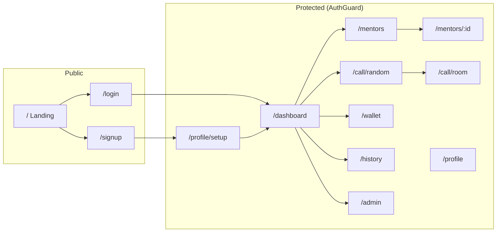

### State Flow
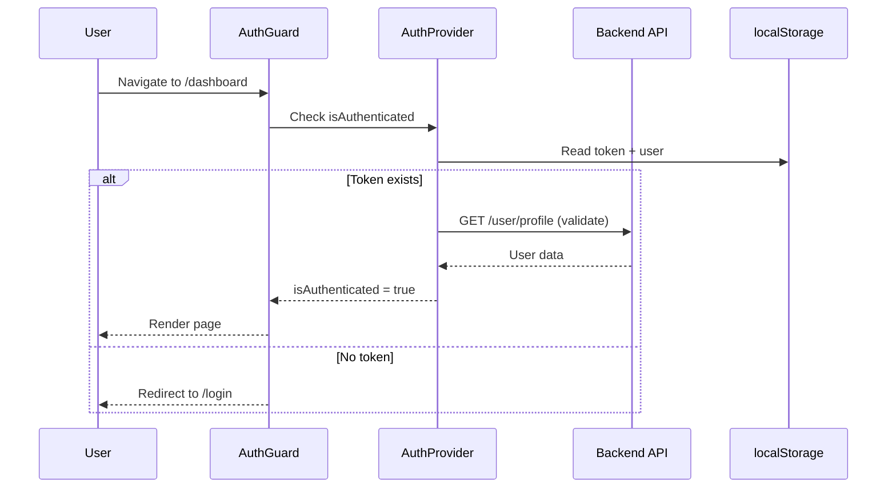

---

## 5. Backend HLD

### Request Pipeline
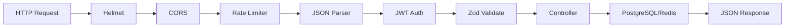

### Socket Pipeline
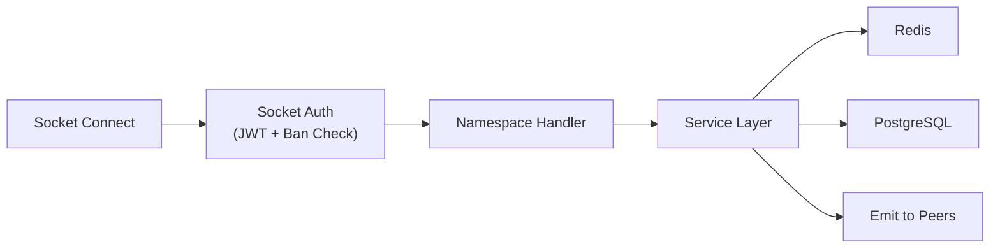

### Module Dependency Graph
```
server.js
├── config/index.js (env vars)
├── middlewares/ (auth, rateLimiter, validate)
├── routes/index.js
│   ├── authRoutes → authController → otpService → redis
│   ├── userRoutes → userController → pool + redis (cache)
│   ├── mentorshipRoutes → mentorshipController → pool
│   ├── sessionRoutes → sessionController → pool
│   ├── ratingRoutes → ratingController → pool
│   ├── safetyRoutes → safetyController → pool
│   ├── adminRoutes → adminController → pool + matchingService
│   └── walletRoutes → walletController → pool
├── sockets/
│   ├── matchSocket → matchingService → redis + pool
│   └── signalingSocket (stateless relay)
└── db/ (pool, redis, schema)
```

---

## 6. Database HLD

### Schema Overview
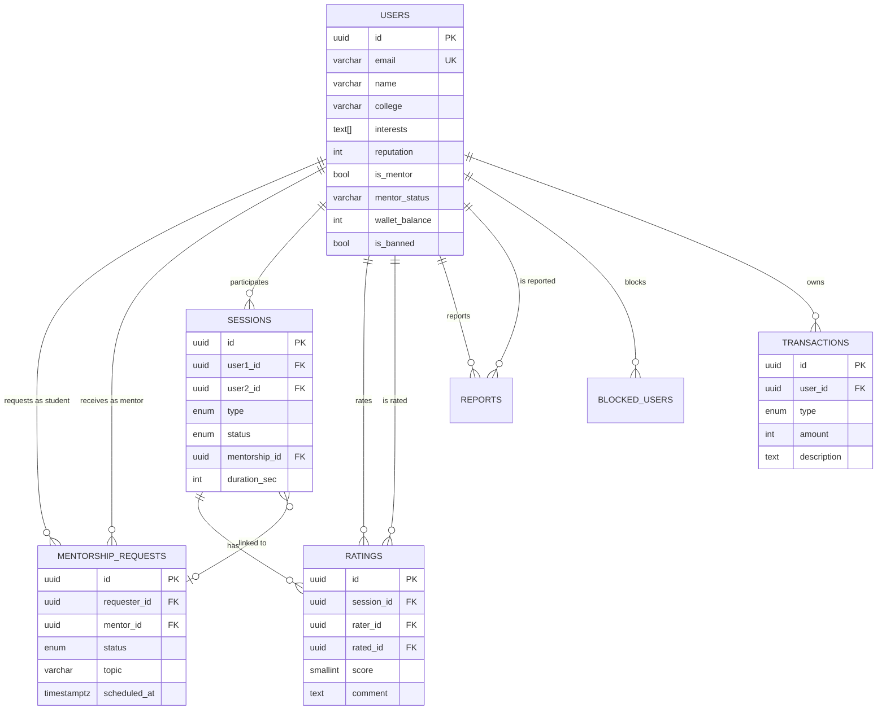

### Redis Key Schema
| Pattern | Type | TTL | Purpose |
|---------|------|-----|---------|
| `otp:{email}` | String | 300s | OTP storage for verification |
| `match:queue` | List | — | FIFO matchmaking queue |
| `match:presence:{userId}` | String | 300s | Online status indicator |
| `match:session:{sessionId}` | Hash | 3600s | Active session metadata |
| `cache:mentors:all` | String | 60s | Cached mentor listing |

---

## 7. API Communication Flow

### Random Matching Flow
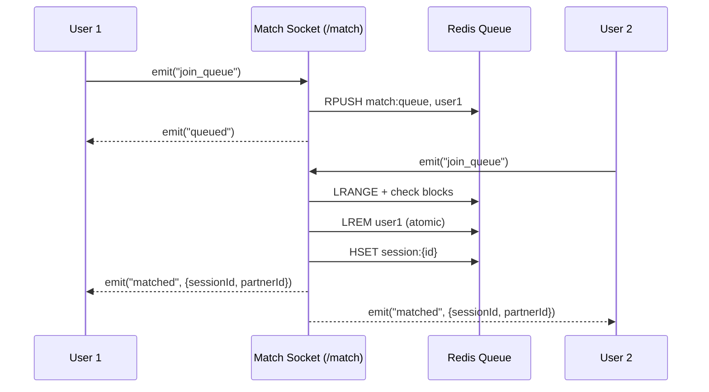

### WebRTC Signaling Flow
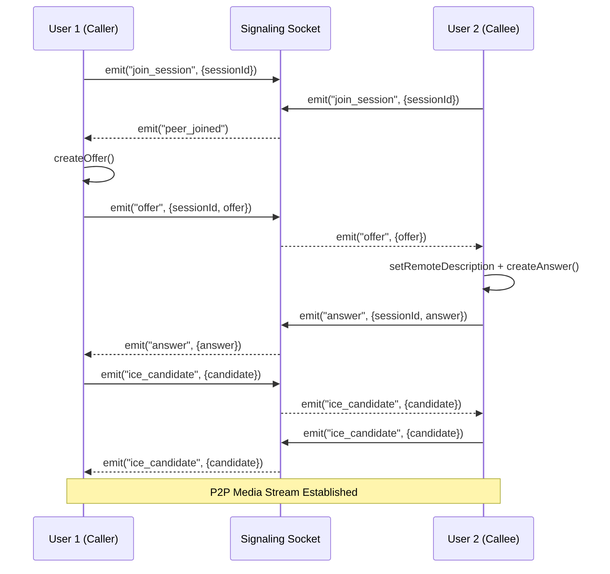

---

## 8. Authentication Architecture

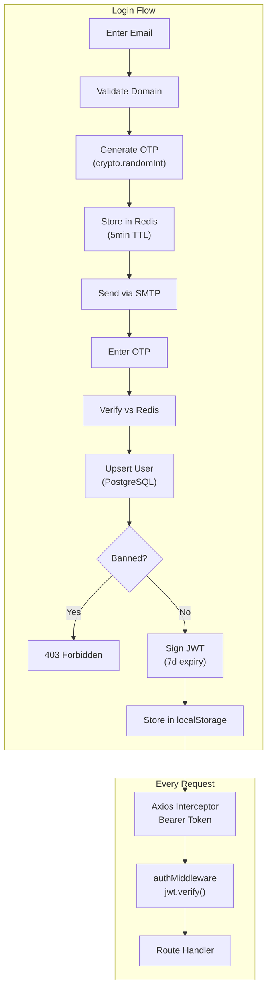

---

## 9. Deployment Architecture

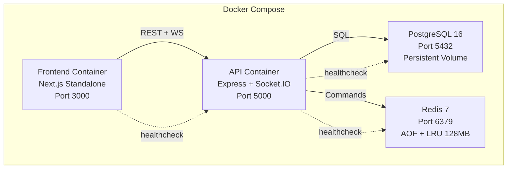

---

## 10. Scaling Strategy

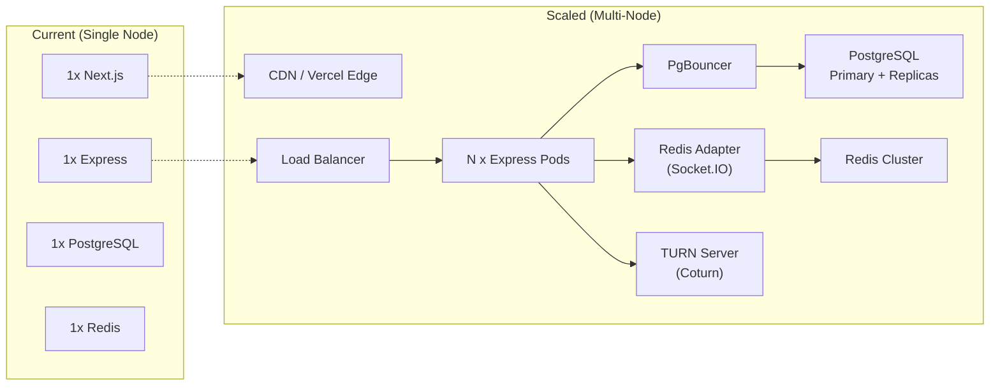

| Layer | Current | Phase 2 | Phase 3 |
|-------|---------|---------|---------|
| Frontend | Single container | Vercel + CDN | Edge rendering |
| Backend | Single process | PM2 cluster (4 workers) | Kubernetes HPA |
| Database | Single PostgreSQL | PgBouncer + read replica | Citus/sharding |
| Cache | Single Redis | Redis Sentinel | Redis Cluster |
| WebSocket | In-memory map | Redis adapter | Dedicated WS service |
| Video | P2P (STUN only) | Add TURN server | SFU for group calls |

---

## 11. Security Architecture

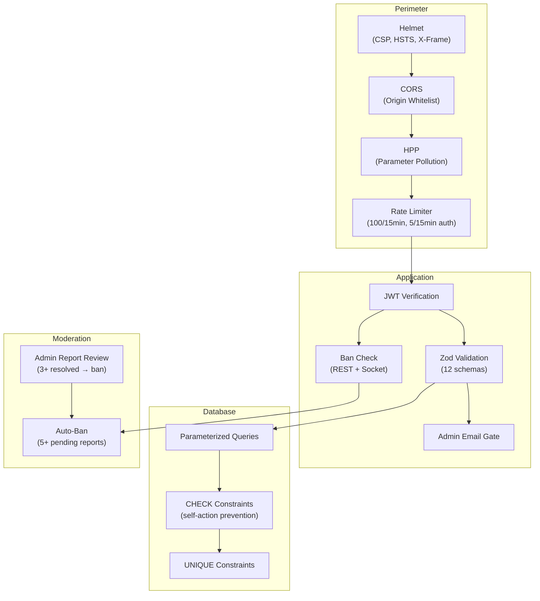

---

## 12. External Services

| Service | Usage | Fallback |
|---------|-------|----------|
| Google STUN (`stun.l.google.com:19302`) | NAT traversal for WebRTC | Secondary STUN server configured |
| SMTP (Gmail/SendGrid) | OTP email delivery | Console log in development mode |
| PostgreSQL | Persistent data storage | Docker volume with auto-init schema |
| Redis | Ephemeral state (OTP, queue, presence, cache) | AOF persistence, LRU eviction at 128MB |

---

## 13. Data Flow

### User Registration → First Session
```
1. POST /auth/login {email} → Redis: SET otp:{email} → SMTP: send OTP
2. POST /auth/verify {email, otp} → Redis: GET+DEL otp → PostgreSQL: UPSERT user → JWT
3. POST /user/profile/complete {name, college} → PostgreSQL: UPDATE users
4. Socket /match: join_queue → Redis: RPUSH match:queue
5. Socket /match: matched {sessionId} → Redis: HSET session → PostgreSQL: INSERT session
6. Socket /signaling: join_session → offer → answer → ICE → P2P video established
7. Socket /match: skip → PostgreSQL: UPDATE session (ended) → Re-queue
8. POST /rating/submit {score} → PostgreSQL: INSERT rating → UPDATE reputation
```

---

## 14. Key Engineering Decisions

| Decision | Rationale | Trade-off |
|----------|-----------|-----------|
| **Passwordless OTP** | No password storage, eliminates credential attacks | Depends on email delivery speed |
| **Redis matchmaking queue** | Sub-millisecond operations, atomic list operations | In-memory (requires persistence config) |
| **P2P WebRTC (no SFU)** | Zero media server cost, lowest latency for 1v1 | Fails behind strict NATs without TURN |
| **Socket.IO over raw WS** | Built-in reconnection, rooms, namespaces, fallback transport | Larger bundle than raw WebSocket |
| **PostgreSQL over MongoDB** | Relational integrity (FKs, constraints, enums), complex JOINs for history/ratings | Schema migrations needed for changes |
| **Zod over Joi** | TypeScript-first, smaller bundle, better inference | Less community middleware |
| **localStorage for JWT** | Simple, works across tabs | Vulnerable to XSS (mitigated by CSP) |
| **Client-side rendering** | Real-time state requires client-side Socket.IO/WebRTC | No SSR SEO for authenticated pages (acceptable) |
| **Monolith backend** | Simpler deployment, single codebase, shared Socket.IO state | Must refactor for microservices at scale |
| **Mentor cache (60s TTL)** | Reduces DB load on high-traffic listing page | Stale data for up to 60 seconds |

---

*Document Version: 1.0 — May 2026*
*Generated from live codebase analysis*
